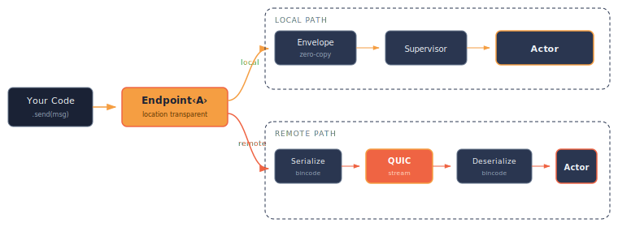

# Actors and Messages

This chapter covers the core building blocks: actors, state, messages, handlers, and endpoints.

## Actors

An actor in murmer is a small server defined as a Rust struct with a set of handler methods, persisting state, and message types. You define an actor by implementing the `Actor` trait, then implementing `Handler` methods for each message type it can handle.

```rust,ignore
use murmer::prelude::*;

#[derive(Debug)]
struct ChatRoom;

struct ChatRoomState {
    room_name: String,
    messages: Vec<ChatEntry>,
}

impl Actor for ChatRoom {
    type State = ChatRoomState;
}
```

Key points:
- The actor struct itself is typically a zero-sized type (no fields). All mutable state lives in the associated `State` type.
- State is passed as `&mut State` to every handler, keeping the actor struct itself lightweight and the state explicitly threaded.
- Each actor runs inside a [supervisor](./supervision.md) that manages its lifecycle, mailbox, and restart behavior.

## Messages

A message is a type that can be sent to an actor. Every message defines a result type and can optionally be serializable for remote delivery.

There are two ways to define messages:

### Auto-generated messages (recommended)

When using `#[handlers]` with `#[handler]`, the macro generates message structs automatically from your method signatures:

```rust,ignore
#[handlers]
impl ChatRoom {
    #[handler]
    fn post_message(
        &mut self,
        _ctx: &ActorContext<Self>,
        state: &mut ChatRoomState,
        from: String,
        text: String,
    ) -> usize {
        state.messages.push(ChatEntry { from, text });
        state.messages.len()
    }

    #[handler]
    fn get_history(
        &mut self,
        _ctx: &ActorContext<Self>,
        state: &mut ChatRoomState,
    ) -> Vec<String> {
        state.messages.iter()
            .map(|e| format!("{}: {}", e.from, e.text))
            .collect()
    }
}
```

This generates `PostMessage { pub from: String, pub text: String }` and `GetHistory` unit struct, plus all the trait implementations and an extension trait `ChatRoomExt` on `Endpoint<ChatRoom>`.

### Explicit messages

For messages shared across multiple actors, define them manually with `#[derive(Message)]`:

```rust,ignore
use murmer_macros::Message;
use serde::{Serialize, Deserialize};

#[derive(Debug, Clone, Serialize, Deserialize, Message)]
#[message(result = Vec<String>, remote = "orchestrator::ListDir")]
struct ListDir {
    path: String,
}
```

Then reference it in a handler with the `msg` parameter name:

```rust,ignore
#[handlers]
impl StorageAgent {
    #[handler]
    fn list_dir(
        &mut self,
        _ctx: &ActorContext<Self>,
        state: &mut StorageState,
        msg: ListDir,
    ) -> Vec<String> {
        state.dirs.get(&msg.path).cloned().unwrap_or_default()
    }
}
```

The `remote = "..."` attribute is optional — omit it for local-only messages that don't need wire serialization.

### Async handlers

Handlers that need to `await` use `async fn`:

```rust,ignore
#[handlers]
impl MyActor {
    #[handler]
    async fn fetch_data(
        &mut self,
        ctx: &ActorContext<Self>,
        state: &mut MyState,
        url: String,
    ) -> Vec<u8> {
        some_async_call(&url).await
    }
}
```

This generates an `AsyncHandler<FetchData>` implementation instead of `Handler<FetchData>`.

## Endpoints

Endpoints are opaque handles to actors used to send messages and receive responses. The `Endpoint<A>` type abstracts where the actor lives — whether local or remote — and handles serialization in the background.

```rust,ignore
// Start returns a typed endpoint
let counter = system.start("counter/main", Counter, CounterState { count: 0 });

// Send via auto-generated extension trait
let result = counter.increment(5).await.unwrap();

// Or send a message struct directly
let result = counter.send(Increment { amount: 5 }).await.unwrap();
```

### Location transparency

The key design principle: `Endpoint<A>` hides whether the actor is local or remote.

<p align="center">
  
</p>

- **Local actors** use the envelope pattern — zero serialization cost, direct in-memory dispatch through a type-erased trait object.
- **Remote actors** serialize messages with bincode, send them over QUIC streams, and deserialize responses on return.

The caller's code is identical in both cases:

```rust,ignore
let result = endpoint.send(Increment { amount: 5 }).await?;
```

### How endpoints work under the hood

Under the hood, an endpoint wraps a tokio channel that sends messages to the actor's supervisor:

- **Local endpoint**: The channel connects directly to the actor's supervisor (mpsc). Messages are dispatched as type-erased envelopes with zero serialization cost.
- **Remote endpoint**: The channel connects to a *proxy supervisor* that serializes the message in bincode format, sends it through a QUIC stream, awaits the response, deserializes it, and returns it to the caller.

Endpoints are lightweight and `Clone` — share them freely across tasks.

## Actor watches

Erlang-style actor monitoring — get notified when a watched actor terminates:

```rust,ignore
impl Actor for Monitor {
    type State = MonitorState;

    fn on_actor_terminated(
        &mut self,
        state: &mut MonitorState,
        terminated: &ActorTerminated,
    ) {
        match &terminated.reason {
            TerminationReason::Panicked(msg) => {
                tracing::error!("{} panicked: {}", terminated.label, msg);
            }
            _ => {}
        }
    }
}

#[handlers]
impl Monitor {
    #[handler]
    fn watch_actor(
        &mut self,
        ctx: &ActorContext<Self>,
        _state: &mut MonitorState,
        label: String,
    ) {
        ctx.watch(&label);
    }
}
```

The `ActorContext` provides the `watch()` method, and termination notifications arrive via the `on_actor_terminated` callback on the `Actor` trait.
