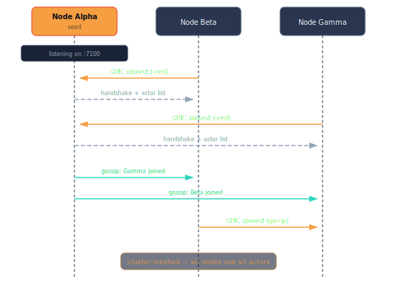
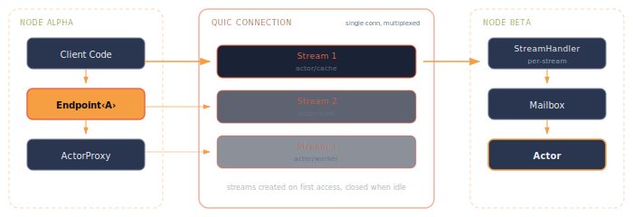

# Clustering

One of murmer's core design goals is that your actor code doesn't change when you go from a single process to a multi-node cluster. The same `Endpoint<A>` API works in both cases.

## Step 1: Run everything locally

Create a `System::local()` — no networking, no config. Your actors communicate through in-memory channels with zero serialization cost:

```rust,ignore
use murmer::prelude::*;

let system = System::local();

let room = system.start("room/general", ChatRoom, ChatRoomState {
    room_name: "general".into(),
    messages: vec![],
});

// Send messages via extension trait — works instantly
room.post_message("alice".into(), "Hello!".into()).await?;

// Look up actors by label
let ep = system.lookup::<ChatRoom>("room/general").unwrap();
let history = ep.get_history().await?;
```

## Step 2: Go distributed

When you're ready for real networking, swap `System::local()` for `System::clustered()`. **Your actor code stays identical** — only the system construction changes:

```rust,ignore
use murmer::prelude::*;
use murmer::cluster::config::ClusterConfig;

let config = ClusterConfig::builder()
    .name("alpha")
    .listen("0.0.0.0:7100".parse()?)
    .advertise("192.168.1.5:7100".parse()?)
    .cookie("my-cluster-secret")
    .seed_nodes(["192.168.1.1:7100".parse()?])
    .build()?;

// clustered_auto() discovers all #[handlers]-annotated actor types automatically
let system = System::clustered_auto(config).await?;

// Same API as local — start, lookup, send
let room = system.start("room/alpha", ChatRoom, state);
room.post_message("alice".into(), "Hello!".into()).await?;

// Actors on other nodes appear automatically via registry replication
let remote_room = system.lookup::<ChatRoom>("room/beta").unwrap();
remote_room.get_history().await?;  // transparently serialized over QUIC
```

Each node gets a single QUIC connection to every peer, multiplexed over per-actor streams. The OpLog replication protocol uses version vectors for efficient, idempotent sync.

## Step 3: Test it interactively

The `cluster_chat` example lets you try both modes with an interactive CLI:

```sh
# Local mode — all actors in one process
cargo run -p murmer-examples --bin cluster_chat -- --local
```

```text
=== murmer cluster_chat (local mode) ===
  Started room: #general
  Started room: #random

> post general alice Hello everyone!
  [1 messages in #general]
> post general bob Hey alice!
  [2 messages in #general]
> history general
  --- #general ---
  alice: Hello everyone!
  bob: Hey alice!
> rooms
  Known rooms:
    #general — 2 messages
    #random — 0 messages
```

Same binary, same commands — just add cluster config:

```sh
# Terminal 1 — seed node
cargo run -p murmer-examples --bin cluster_chat -- --node alpha --port 7100

# Terminal 2 — joins via seed
cargo run -p murmer-examples --bin cluster_chat -- --node beta --port 7200 --seed 127.0.0.1:7100
```

## Step 4: Deploy with Docker

The `docker-compose.yml` in the repo runs a 3-node cluster:

```sh
docker compose up --build
```

This starts three containers — `alpha`, `beta`, and `gamma` — each running the `cluster_chat` example:

```yaml
services:
  alpha:
    build: .
    command: ["--node", "alpha", "--port", "7100"]

  beta:
    build: .
    command: ["--node", "beta", "--port", "7100", "--seed", "alpha:7100"]

  gamma:
    build: .
    command: ["--node", "gamma", "--port", "7100", "--seed", "alpha:7100"]
```

Beta and gamma seed from alpha and automatically mesh together.

## How clustering works

<p align="center">
  
</p>

### Auto-discovery

When an actor system starts in clustered mode, it runs a server that listens for incoming connections. New nodes connect to existing ones via seed nodes and begin exchanging information about their actors. Nodes can be configured to gossip this information, allowing the network to mesh together organically.

### Networking layer

The networking layer is built on **QUIC** (via the `quinn` crate) and **SWIM** (via the `foca` crate):

- **QUIC** provides a reliable, low-latency transport with built-in TLS encryption. Each node pair shares a single QUIC connection, multiplexed over per-actor streams.
- **SWIM** handles cluster membership — failure detection, protocol-level heartbeats, and member state dissemination.
- **mDNS** provides optional zero-configuration discovery for LAN environments.

### Stream architecture

<p align="center">
  
</p>

When a remote actor's endpoint is accessed:

1. A dedicated QUIC stream is opened to the remote node for that actor.
2. The stream stays open as long as it's active (not idle).
3. On the receiving end, a stream handler deserializes incoming messages, looks up the target actor via the receptionist, and forwards them.
4. Each stream binds to a single actor — messages for other actors result in an error and stream closure.
5. The stream subscribes to the actor's lifecycle via the receptionist. If the actor enters a negative state (stopped, dead), the stream closes with an error.

An actor on a node might have multiple inbound streams, but the mailbox system ensures messages are processed in order of arrival.

### Registry replication

Actor registrations are replicated across the cluster using an **OpLog** with **version vectors**:

- When a local actor registers, its node broadcasts an `ActorAdd` operation to all peers.
- Remote nodes create lazy endpoint factories in their local receptionists.
- Version vectors ensure operations are idempotent and ordering is preserved.
- When a node leaves, its registrations are pruned from all other nodes.

This gives every node an eventually consistent view of the entire cluster's actor topology.
