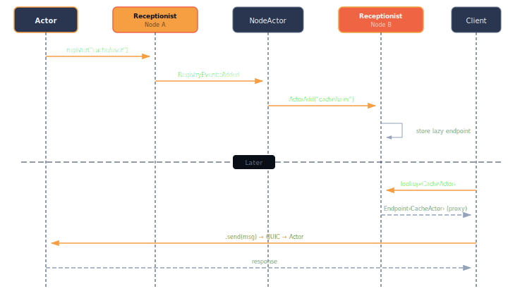

# Discovery

Murmer provides a unified actor discovery system through the **Receptionist** — a type-erased registry that handles registration, lookup, and subscription for both local and remote actors.

## Labels

Actors are identified by path-like labels: `"cache/user"`, `"worker/0"`, `"thumbnail/processor/3"`.

```rust,ignore
let ep = system.start("service/auth", AuthActor, AuthState::new());
let ep = system.lookup::<AuthActor>("service/auth").unwrap();
```

Labels serve as the primary routing key in the system:
- No two actors can have the same label in the clustered system.
- The path structure (`"group/subgroup/instance"`) enables hierarchical organization of actors.
- Wildcards can be used in subscriptions on the receptionist (e.g., subscribe to all actors under `"worker/*"`).
- Labels are only used for actor discovery and routing — they are a feature of the receptionist, not intrinsic to actors themselves.

## The Receptionist

The Receptionist is a special internal actor started with every actor system. It manages the lookup and registration of both local and remote actors.

When an actor is started, it registers itself with the receptionist. The receptionist maintains a mapping of labels and actor types to their corresponding endpoints. When you want to communicate with an actor, you query the receptionist with the actor type and label to receive an endpoint.

### Typed lookup

Lookups are type-safe — you specify the actor type and get back a typed endpoint:

```rust,ignore
// Returns Option<Endpoint<AuthActor>>
let endpoint = system.lookup::<AuthActor>("service/auth");
```

If the label doesn't exist or the type doesn't match, `None` is returned. For remote actors, the receptionist returns an endpoint that transparently handles connection management when accessed.

### State observation

When an actor is registered, the receptionist becomes an observer of its state. If the actor stops or crashes, the receptionist is notified and removes the actor from its registry. This ensures the receptionist always has an up-to-date view of the actors in the system.

If an actor restarts (via [supervision](./supervision.md)), the receptionist is notified but the actor remains available — the state is non-negative (alive or restarting, not dead).

## Reception keys and listings

Group actors by type and subscribe to changes:

```rust,ignore
let worker_key = ReceptionKey::<Worker>::new("workers");

// Check actors into the group
receptionist.check_in("worker/0", worker_key.clone());
receptionist.check_in("worker/1", worker_key.clone());

// Subscribe — get existing actors immediately + live updates
let mut listing = receptionist.listing(worker_key);
while let Some(endpoint) = listing.next().await {
    endpoint.send(Work { task: "process".into() }).await?;
}
```

A `Listing<A>` is an async stream that yields endpoints as actors register and deregister against a `ReceptionKey`. It provides both backfill (existing actors) and live updates (new registrations), making it ideal for dynamic pool management.

## Lifecycle events

Subscribe to all actor registrations and deregistrations across the system:

```rust,ignore
let mut events = receptionist.subscribe_events();
while let Some(event) = events.recv().await {
    match event {
        ActorEvent::Registered { label, actor_type } => { /* ... */ }
        ActorEvent::Deregistered { label, actor_type } => { /* ... */ }
    }
}
```

Other actors can subscribe to the receptionist to receive notifications about actors being added, removed, or updated. Subscriptions can be broad (all actor updates, useful for clustering) or specific (a particular actor type or label).

## Routing

Distribute messages across actor pools:

```rust,ignore
let router = Router::new(
    vec![ep1, ep2, ep3],
    RoutingStrategy::RoundRobin,
);

// Each send goes to the next endpoint in sequence
router.send(Increment { amount: 1 }).await?;

// Or broadcast to all
let results = router.broadcast(GetCount).await;
```

The `Router<A>` takes a set of endpoints and a `RoutingStrategy` to distribute messages. Current strategies include round-robin and broadcast.

## How discovery works across nodes

When running in [clustered mode](./clustering.md), the receptionist automatically synchronizes actor registrations across nodes:

<p align="center">
  
</p>

1. A local actor registers with its node's receptionist.
2. The node broadcasts an `ActorAdd` notification to all connected peers.
3. Remote nodes register the actor in their local receptionists with a lazy endpoint factory.
4. When a client looks up the remote actor, the endpoint factory creates a proxy that handles network transport.
5. If the actor's node fails, all remote registrations are cleaned up automatically.

This means `system.lookup::<MyActor>("some/label")` works identically whether the actor is local or on a remote node — the receptionist handles the difference transparently.
