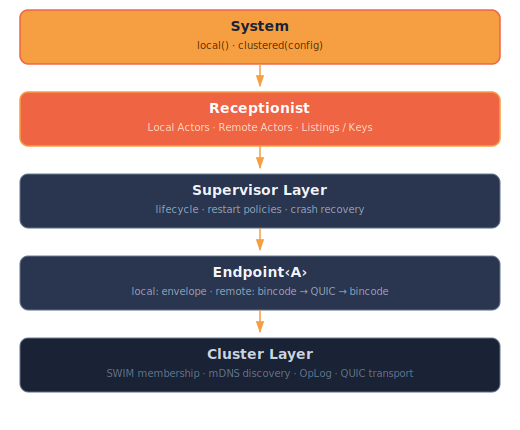
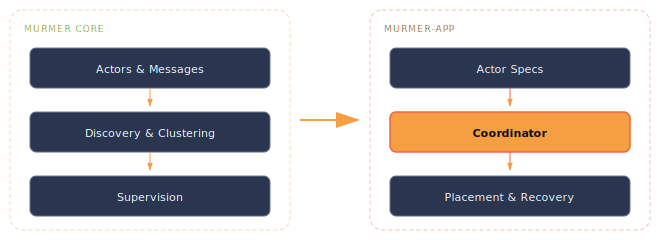

<p align="center">
  
</p>

---

# Introduction

Murmer is a distributed actor framework for Rust, built on tokio and QUIC.

It provides typed, location-transparent actors that communicate through message passing. Whether an actor lives in the same process or on a remote node across the network, you interact with it through the same `Endpoint<A>` API.

<details>
<summary><strong>Why I built this</strong></summary>

I've spent years working with Elixir and the BEAM VM, and the actor model there is something I've grown deeply fond of — the simplicity of processes, message passing, and supervision just *works*. When I looked at bringing that experience to Rust, I studied existing implementations like Actix, Telepathy, and Akka (on the JVM side). They're impressive systems, but I kept running into the same friction: getting a basic actor up and running was complex, and adding remote communication across nodes was even more so.

Murmer is an experiment in answering a simple question: **can you build a robust distributed actor system in Rust that's actually simple to use?**

The answer, it seems, is yes.

The design draws heavy inspiration from BEAM OTP's supervision and process model, Akka's clustering approach, and Apple's Swift Distributed Actors for the typed, location-transparent endpoint API. The goal is to combine these ideas with Rust's performance and safety guarantees — zero-cost local dispatch, compile-time message type checking, and automatic serialization over encrypted QUIC connections when actors span nodes.

</details>

## Murmer in 1 minute

**Install:**

```toml
[dependencies]
murmer = "0.1"
murmer-macros = "0.1"
serde = { version = "1", features = ["derive"] }
tokio = { version = "1", features = ["full"] }
```

**Write an actor, send it messages:**

```rust,ignore
use murmer::prelude::*;
use murmer_macros::handlers;

// ① Define your actor — state lives separately
#[derive(Debug)]
struct Counter;
struct CounterState { count: i64 }

impl Actor for Counter {
    type State = CounterState;
}

// ② Handlers become the actor's API
#[handlers]
impl Counter {
    #[handler]
    fn increment(
        &mut self,
        _ctx: &ActorContext<Self>,
        state: &mut CounterState,
        amount: i64,
    ) -> i64 {
        state.count += amount;
        state.count
    }

    #[handler]
    fn get_count(
        &mut self,
        _ctx: &ActorContext<Self>,
        state: &mut CounterState,
    ) -> i64 {
        state.count
    }
}

#[tokio::main]
async fn main() {
    // ③ Create a local actor system
    let system = System::local();

    // ④ Start an actor — returns a typed Endpoint<Counter>
    let counter = system.start("counter/main", Counter, CounterState { count: 0 });

    // ⑤ Send messages via auto-generated extension methods
    let result = counter.increment(5).await.unwrap();
    println!("Count: {result}"); // → Count: 5

    // ⑥ Look up actors by label — works for local and remote
    let found = system.lookup::<Counter>("counter/main").unwrap();
    let count = found.get_count().await.unwrap();
    println!("Looked up: {count}"); // → Looked up: 5
}
```

```sh
cargo run
```

That's it — a complete, working actor system. The rest of this page explains *what's happening under the hood*. The [Getting Started](./getting-started.md) chapter goes deeper into each component.

## What it gives you

- **Send messages without caring where the actor lives.** `counter.increment(5)` (line ⑤) works identically whether the actor is local or on a remote node — the `Endpoint<A>` API abstracts the difference away.
- **Test distributed systems from a single process.** `System::local()` (line ③) runs everything in-memory. Swap to `System::clustered()` when you're ready for real networking — your actor code stays identical.
- **Define actors with minimal boilerplate.** The `#[handlers]` macro (line ②) auto-generates message structs (`Increment`, `GetCount`), dispatch tables, serialization, and the extension methods you call on line ⑤.
- **Get networking and encryption handled for you.** QUIC transport with automatic TLS, SWIM-based cluster membership, and mDNS discovery — all configured, not hand-rolled.
- **Supervise actors like OTP.** Restart policies (Temporary, Transient, Permanent) with configurable limits and exponential backoff keep your system running through failures.
- **Orchestrate applications across a cluster.** The [`murmer-app`](./murmer-app.md) layer adds placement strategies, leader election, and crash recovery — so you can declare *what* should run and *where*, and the framework handles the rest.

## What's happening: line by line

**① Actor + State** — `Counter` is a zero-sized struct. All mutable state lives in `CounterState`, passed as `&mut` to every handler. This keeps the actor lightweight and the state threading explicit.

**② `#[handlers]`** — The macro reads your method signatures and generates:
- Message structs — `Increment { pub amount: i64 }` and `GetCount` (unit struct)
- `Handler<Increment>` and `Handler<GetCount>` trait implementations
- `RemoteDispatch` — a wire-format dispatch table so remote nodes know how to route messages to the right handler
- `CounterExt` — an extension trait on `Endpoint<Counter>` that gives you `.increment(amount)` and `.get_count()` methods

**③ `System::local()`** — Creates the actor runtime and boots the [Receptionist](./discovery.md) — the internal actor registry that tracks all actors by label and type.

**④ `system.start(...)`** — Wraps `Counter` in a [Supervisor](./supervision.md) that manages its lifecycle, mailbox, and restart behavior. Registers it with the Receptionist under the label `"counter/main"`. Returns an `Endpoint<Counter>` — your typed send handle.

**⑤ `counter.increment(5)`** — The extension method constructs an `Increment { amount: 5 }` message and sends it through the Endpoint. Since this is a local actor, the message is dispatched as a zero-copy envelope through the Supervisor's mailbox to the handler. The result comes back through a oneshot channel.

**⑥ `system.lookup(...)`** — Queries the Receptionist for an actor of type `Counter` at label `"counter/main"`. Returns the same `Endpoint<Counter>`. In a clustered system, this could return a proxy endpoint that transparently serializes messages over QUIC to a remote node.

## Core concepts

| Concept | In the example | Purpose |
|---------|----------------|---------|
| **Actor** | `Counter` + `CounterState` | Stateful message processor. Actor has no fields — state lives separately. |
| **Message** | Generated `Increment`, `GetCount` | Defines a request and its response type. |
| **RemoteMessage** | Generated by `#[handlers]` | A message that can cross the wire (serializable + `TYPE_ID`). |
| **Endpoint** | `counter` from `system.start(...)` | Opaque send handle. Abstracts local vs remote — callers never know which. |
| **Receptionist** | Powers `system.lookup(...)` | Type-erased actor registry. Start, lookup, and subscribe to actors. |
| **Router** | Not shown — see [Discovery](./discovery.md) | Distributes messages across a pool of endpoints (round-robin, broadcast). |
| **Listing** | Not shown — see [Discovery](./discovery.md) | Async stream of endpoints matching a `ReceptionKey`. |

## Architecture

<p align="center">
  
</p>

Every layer in this diagram is touched by the example code:

- **System** — created at line ③, runs the entire runtime
- **Receptionist** — populated at line ④ (`start`), queried at line ⑥ (`lookup`)
- **Supervisor Layer** — wraps `Counter` at line ④, manages its mailbox, would handle restarts if configured
- **Endpoint‹A›** — returned at line ④, used at line ⑤ to send messages; local dispatch here, but swap to `System::clustered()` and the same endpoint transparently routes over QUIC
- **Cluster Layer** — not active in `System::local()`, but requires zero code changes to enable (see [Clustering](./clustering.md))

### Key design decisions

- **Endpoint\<A\> is the only API** — callers never know if an actor is local or remote.
- **Receptionist is non-generic** — stores type-erased entries internally, uses `TypeId` guards for safe downcasts at lookup time.
- **Supervisors are flat** — each actor has its own supervisor, no parent-child hierarchy.
- **Labels are paths** — `"cache/user"`, `"worker/0"`, `"thumbnail/processor/3"`. Hierarchical naming for organizational clarity.
- **Fail-fast networking** — if a QUIC stream fails, all pending responses error immediately instead of hanging.

## From primitives to applications

Murmer works at two levels:

**The core** ([Actors](./actors-and-messages.md), [Discovery](./discovery.md), [Supervision](./supervision.md), [Clustering](./clustering.md)) gives you the building blocks — everything you saw in the example above. You can build complete services with just these primitives.

**The application layer** ([Application Orchestration](./murmer-app.md)) builds on top of the core to manage real, running applications across a cluster. You declare *what* actors should run, *where* they should be placed (with constraints like "must have GPU" or "must be a Worker node"), and *what happens when a node fails* — and the Coordinator handles placement, spawning, and crash recovery automatically.

<p align="center">
  
</p>

## Learn more

- [Getting Started](./getting-started.md) — deeper walkthrough of each component
- [API Reference on docs.rs](https://docs.rs/murmer)
- [Source on GitHub](https://github.com/paxsonsa/murmer-rs)
