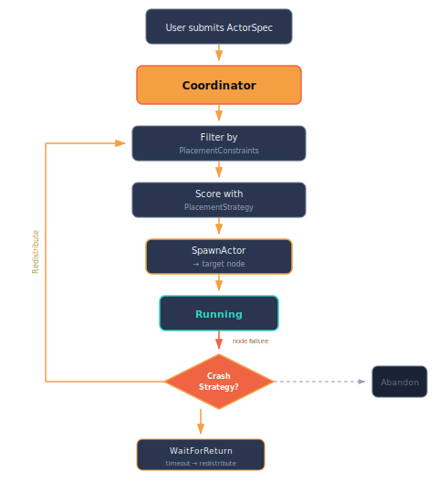

# Application Orchestration

Murmer's core gives you actors, messages, and clustering primitives. The `murmer-app` crate builds on top of these to provide the application-level abstractions you need for real, working distributed applications: **placement strategies**, **leader election**, **crash recovery**, and a **Coordinator** actor that ties them all together.

Think of it this way: murmer gives you the building blocks, and `murmer-app` helps you assemble them into a running system that manages actor lifecycles across a cluster automatically.

## Overview

<p align="center">
  
</p>

The orchestration layer answers three questions:

1. **Where should this actor run?** — Placement strategies score nodes based on load, capabilities, metadata, and constraints.
2. **Who decides?** — Leader election picks one node to run the Coordinator, which makes all placement decisions.
3. **What happens when a node fails?** — Crash strategies define recovery behavior: redistribute immediately, wait for the node to return, or let the actor die.

## Actor specifications

An `ActorSpec` describes an actor that the orchestrator should place and manage. It captures *what* to run, *how* to recover from crashes, and *where* to place it.

```rust,ignore
use murmer_app::spec::{ActorSpec, CrashStrategy, PlacementConstraints};
use murmer::cluster::config::NodeClass;
use std::time::Duration;

let spec = ActorSpec::new("storage/photos", "orchestrator::StorageAgent")
    .with_state(serialized_state)
    .with_crash_strategy(CrashStrategy::WaitForReturn(Duration::from_secs(30)))
    .with_constraints(PlacementConstraints {
        required_classes: vec![NodeClass::Worker],
        required_metadata: [("volume".into(), "photos".into())].into(),
        ..Default::default()
    });
```

### Fields

| Field | Purpose |
|-------|---------|
| `label` | Actor label (e.g., `"storage/photos"`) — unique across the cluster |
| `actor_type_name` | Key into the `SpawnRegistry` — identifies what type of actor to create |
| `initial_state` | Serialized initial state (bincode bytes) sent to the target node |
| `crash_strategy` | What to do when the hosting node fails |
| `placement` | Constraints that filter which nodes are eligible |

### Crash strategies

| Strategy | Behavior |
|----------|----------|
| `Redistribute` | Move to another eligible node immediately (default) |
| `WaitForReturn(Duration)` | Wait for the failed node to rejoin; fall back to `Redistribute` on timeout |
| `Abandon` | Let the actor die with the node — no recovery |

### Placement constraints

Constraints filter eligible nodes *before* the placement strategy scores them:

```rust,ignore
PlacementConstraints {
    required_classes: vec![NodeClass::Worker],        // must be a Worker node
    required_metadata: [("gpu".into(), "true".into())].into(), // must have gpu=true
    anti_affinity_labels: vec!["db/primary".into()],  // don't co-locate with this actor
    ..Default::default()
}
```

- `required_classes` — empty means any class is acceptable.
- `required_metadata` — the node must have all specified key-value pairs.
- `anti_affinity_labels` — avoid placing on nodes already running these actors.

## Placement strategies

The `PlacementStrategy` trait defines a fitness function that scores nodes for hosting a given actor spec. The Coordinator evaluates all eligible nodes (after constraint filtering) and picks the highest scorer.

```rust,ignore
trait PlacementStrategy {
    fn fitness(&self, node: &NodeInfo, spec: &ActorSpec, view: &ClusterView) -> f64;
}
```

- Return `0.0` or negative to indicate "do not place here".
- Higher values mean stronger preference.
- The full `ClusterView` is available for global-aware decisions (e.g., load balancing).

### Built-in strategies

| Strategy | Behavior |
|----------|----------|
| `LeastLoaded` | Place on the node running the fewest actors |
| `RandomPlacement` | Uniform random selection across eligible nodes |
| `Pinned(node_id)` | Always prefer a specific node; fall back if unavailable |

## Leader election

The `LeaderElection` trait is pluggable. The Coordinator only runs on the elected leader node.

```rust,ignore
trait LeaderElection {
    fn elect(&self, view: &ClusterView) -> Option<String>;
}
```

The default implementation, `OldestNode`, picks the node with the lowest incarnation counter. This is **deterministic** — all nodes independently compute the same answer without a consensus round.

```rust,ignore
use murmer_app::election::OldestNode;
use murmer::cluster::config::NodeClass;

// Any alive node can be leader
let election = OldestNode::any();

// Only Edge nodes can be leader
let election = OldestNode::with_class(NodeClass::Edge);
```

## The Coordinator

The Coordinator is itself a murmer actor (dogfooding the framework). It maintains a `ClusterView`, accepts `SubmitSpec` messages, and handles crash recovery when nodes fail.

### Lifecycle

1. The Coordinator starts on the elected leader node.
2. It subscribes to cluster events to track node joins and failures.
3. Users send `SubmitSpec` messages to declare what actors should run.
4. The Coordinator evaluates placement constraints and strategies, then sends `SpawnActor` control messages to target nodes.
5. When a node fails, the Coordinator re-places affected actors according to each spec's `CrashStrategy`.

### The cluster event bridge

The bridge (`murmer_app::bridge`) connects the raw cluster machinery to the Coordinator. It subscribes to `ClusterEvents` and translates them into Coordinator messages (`NotifyNodeJoined`, `NotifyNodeFailed`, `NotifyNodeLeft`, `NotifySpawnAck`). This keeps the Coordinator decoupled from the transport layer.

The recommended setup uses `bridge::start_coordinator()`:

```rust,ignore
use murmer_app::bridge;
use murmer_app::coordinator::CoordinatorState;
use murmer_app::placement::LeastLoaded;
use murmer_app::election::OldestNode;

let cluster = system.cluster_system().unwrap();
let state = CoordinatorState::new(
    cluster.identity().node_id_string(),
    Box::new(LeastLoaded),
    Box::new(OldestNode::with_class(NodeClass::Edge)),
);

let coordinator = bridge::start_coordinator(cluster, state);
```

This wires up everything: the Coordinator actor, the event bridge loop, and the spawn drain loop (which sends placement decisions to the transport layer).

### The cluster view

The `ClusterView` is the Coordinator's world model — a snapshot of all nodes with their capabilities and running actors:

```rust,ignore
// Query the Coordinator's view
let view = coordinator.send(GetClusterView).await?;
println!("Alive nodes: {}", view.alive_count);
println!("Total nodes: {}", view.total_count);

// Query managed specs
let specs = coordinator.send(GetSpecs).await?;
for spec in &specs {
    println!("{}: {:?} on {}", spec.label, spec.state, spec.node_id);
}
```

Each node in the view carries:
- **Identity** — name, host, port, incarnation counter
- **Class** — `Worker`, `Edge`, `Coordinator`, etc.
- **Metadata** — arbitrary key-value pairs (e.g., `"volume" = "photos"`)
- **Running actors** — labels of actors currently hosted
- **Liveness** — whether the node is reachable

## Full example: Filesystem RPC

The [`orchestrator`](https://github.com/paxsonsa/murmer-rs/blob/main/examples/src/orchestrator.rs) example demonstrates the full orchestration loop:

1. Three nodes form a cluster: a **gateway** (Edge class) and two **workers** (store-a, store-b).
2. Each worker advertises capabilities via metadata (`"volume" = "photos"` or `"volume" = "docs"`).
3. The gateway runs a Coordinator that places `StorageAgent` actors on workers matching their placement constraints.
4. Clients query storage agents for directory listings and file reads — transparently routed across the cluster.
5. Node failure triggers crash strategy handling.

```rust,ignore
// Submit a spec with placement constraints
let result = coordinator.send(SubmitSpec {
    spec: ActorSpec::new("storage/photos", "orchestrator::StorageAgent")
        .with_state(photos_state_bytes)
        .with_crash_strategy(CrashStrategy::WaitForReturn(Duration::from_secs(30)))
        .with_constraints(PlacementConstraints {
            required_classes: vec![NodeClass::Worker],
            required_metadata: [("volume".into(), "photos".into())].into(),
            ..Default::default()
        }),
}).await?;

// The Coordinator placed the actor — now query it from any node
let photos = system.lookup::<StorageAgent>("storage/photos").unwrap();
let entries = photos.send(ListDir { path: "/".into() }).await?;
```

Run the example:

```sh
cargo test -p murmer-examples --test orchestrator
```
