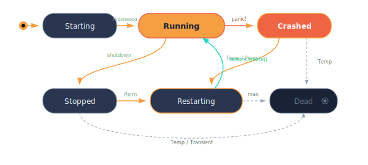

# Supervision

Every actor in murmer runs inside a supervisor. The supervisor manages the actor's lifecycle — starting it, processing its mailbox, and restarting it when things go wrong. This model is directly inspired by Erlang/OTP's supervision trees, adapted for Rust's ownership and type system.

## How supervisors work

Each actor gets its own supervisor. The supervisor is responsible for:

- **Starting** the actor and registering it with the [receptionist](./discovery.md).
- **Mailbox processing** — ingesting messages and passing them to the actor's handlers in order of arrival.
- **Crash detection** — catching panics and deciding what to do next based on the restart policy.
- **Restarting** the actor using a factory if the policy allows it.
- **State notifications** — informing the receptionist of state changes (started, stopped, dead, etc.).
- **Context** — providing the actor with access to the system, receptionist, and other actors via `ActorContext`.

Supervisors are **flat** — there is no parent-child hierarchy between actors. Each actor is independent and can be stopped or restarted without affecting others.

## Actor lifecycle

The supervisor manages an actor through a well-defined set of states:

<p align="center">
  
</p>

## Restart policies

Actors can be started with restart policies that control behavior on failure:

| Policy | Restart on panic? | Restart on clean stop? |
|--------|-------------------|------------------------|
| `Temporary` | No | No |
| `Transient` | Yes | No |
| `Permanent` | Yes | Yes |

- **Temporary** — the actor runs once. If it panics or stops, it's gone. This is the default.
- **Transient** — the actor restarts if it panics, but a clean shutdown is respected. Use this for actors that should survive crashes but can be intentionally stopped.
- **Permanent** — the actor always restarts, whether it panicked or stopped cleanly. Use this for critical services that must always be running.

## Configuration

To use restart policies, you provide an `ActorFactory` (which knows how to create fresh instances) and a `RestartConfig`:

```rust,ignore
use murmer::{RestartPolicy, RestartConfig, BackoffConfig, ActorFactory};
use std::time::Duration;

struct MyFactory;
impl ActorFactory for MyFactory {
    type Actor = Counter;
    fn create(&mut self) -> (Counter, CounterState) {
        (Counter, CounterState { count: 0 })
    }
}

let endpoint = receptionist.start_with_config(
    "counter/resilient",
    MyFactory,
    RestartConfig {
        policy: RestartPolicy::Permanent,  // Always restart
        max_restarts: 5,                   // Max 5 restarts...
        window: Duration::from_secs(60),   // ...within 60 seconds
        backoff: BackoffConfig {
            initial: Duration::from_millis(100),
            max: Duration::from_secs(30),
            multiplier: 2.0,
        },
    },
);
```

### Restart limits

The `max_restarts` and `window` fields prevent infinite restart loops. If the actor exceeds the restart limit within the time window, the supervisor gives up and the actor is permanently stopped. This prevents a persistent bug from consuming all your resources.

### Exponential backoff

The `BackoffConfig` controls the delay between restarts:

- `initial` — delay before the first restart attempt.
- `max` — maximum delay (the backoff caps here).
- `multiplier` — each subsequent restart delay is multiplied by this factor.

For example, with `initial: 100ms`, `max: 30s`, `multiplier: 2.0`, restarts happen at 100ms, 200ms, 400ms, 800ms, ... up to 30s.

## Actor factories

The `ActorFactory` trait gives the supervisor a way to create fresh actor instances for restarts:

```rust,ignore
trait ActorFactory {
    type Actor: Actor;
    fn create(&mut self) -> (Self::Actor, <Self::Actor as Actor>::State);
}
```

The factory is called each time the supervisor needs a new instance. It can carry its own state if needed — for example, incrementing a generation counter or loading configuration from disk.

## Interaction with the receptionist

When a supervised actor restarts:
1. The old actor instance is dropped.
2. The supervisor creates a new instance via the factory.
3. The new instance is registered with the receptionist under the same label.
4. Any actors watching the old instance receive a termination notification, but the label remains routable.

This means endpoints held by other actors remain valid through restarts — messages sent during the brief restart window are queued in the supervisor's mailbox and delivered to the new instance.
